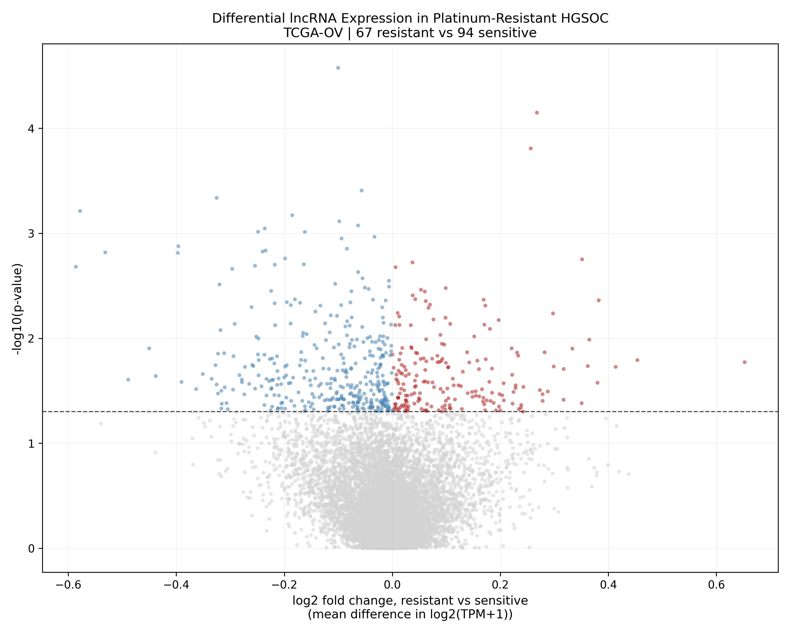

# Differential lncRNA Expression in Platinum-Resistant HGSOC

## Question
Which long non-coding RNAs are expressed differently at diagnosis between
patients who later become platinum-resistant and those who stay
platinum-sensitive?

## Background
High-grade serous ovarian cancer accounts for 70–80% of ovarian cancer deaths.
Most patients respond to first-line platinum chemotherapy, but 80–90% relapse
with resistant disease. Response is graded by the platinum-free interval (PFI),
the time between the last platinum dose and relapse. Under the GCIG consensus a
PFI below 6 months is resistant and a PFI above 12 months is sensitive.

If resistance is already written into the tumour transcriptome at diagnosis, it
could in principle be predicted before treatment rather than observed after it.
This analysis checks whether lncRNAs carry any of that signal.

## Dataset
TCGA-OV RNA-seq, restricted to the 216 confirmed HGSOC primary tumours that
have a definitive platinum status. The filtering cascade is further described in
`prepare_data.py` at the repository root.

Only the two extremes are compared (67 resistant against 94 sensitive). The 55
partially sensitive patients (PFI 6–12 months) sit between the groups and
including them blurs the contrast (for this reason, they were filtered out for this analysis).

## Method
1. log2(TPM+1) normalization (low-expression genes dropped)
2. lncRNA selection from the GENCODE v44 annotation (12,290 lncRNAs left after filtering)
3. Mann-Whitney U test per lncRNA (resistant against sensitive)
4. Benjamini-Hochberg FDR correction across all 12,290 tests

Mann-Whitney rather than a t-test because log-transformed expression is still
visibly non-normal and the two groups are different sizes.

## Results



554 lncRNAs reach raw p < 0.05: 197 higher in resistant patients and 357 lower.
The skew towards downregulation is significant; resistance tracks
with loss of lncRNA expression more than with gain.

Nothing survives FDR correction. The smallest adjusted p-value is 0.326;
the volcano plot indicates why: it is a broad cloud of effects with most effect sizes under 0.6 log2 units.

The strongest individual candidates:

| lncRNA | log2 fold change | p-value | Direction |
|---|---|---|---|
| ENSG00000285925 | −0.100 | 2.65 × 10⁻⁵ | Down in resistant |
| ENSG00000271992 | +0.268 | 7.09 × 10⁻⁵ | Up in resistant |
| ENSG00000228541 | +0.256 | 1.55 × 10⁻⁴ | Up in resistant |
| ENSG00000254177 | −0.057 | 3.91 × 10⁻⁴ | Down in resistant |
| ENSG00000264269 | −0.325 | 4.60 × 10⁻⁴ | Down in resistant |

### Reading the null FDR result
Failing FDR at n = 161 is expected and it lines up
with what other published TCGA-OV lncRNA studies report. Correcting 12,290
tests demands large individual effects, and lncRNAs are expressed at low
absolute levels with high variance between patients. The conclusion: no single lncRNA works as a standalone biomarker of platinum resistance at this cohort size.

The 554 resulting candidates are a screening stage and do not provide individual meaningful results. For this reason, survival risk scores were carried out (check project 2) and externally validated (check project 5).
[Project 02](../02-survival-risk-score) carries them forward into a composite
score with a promising apparent p-value and
[project 05](../05-honest-validation) then shows that apparent performance is
almost entirely selection optimism. In hindsight the null reported here was
the truthful reading of this cohort: at raw p < 0.05 with 12,290 tests,
roughly 615 hits are expected by chance alone, and 554 were observed.

## Output
- `figures/volcano_plot.png`, the figure above
- `results/de_results.csv`, all 12,290 lncRNAs ranked with fold change, p-value
  and adjusted p-value. Regenerated on each run, not tracked in git.

## Usage
```bash
# from the repository root, once
python prepare_data.py

# then
cd 01-differential-expression
python differential_expression.py
```

## Dependencies
```bash
pip install pandas numpy scipy statsmodels matplotlib
```
