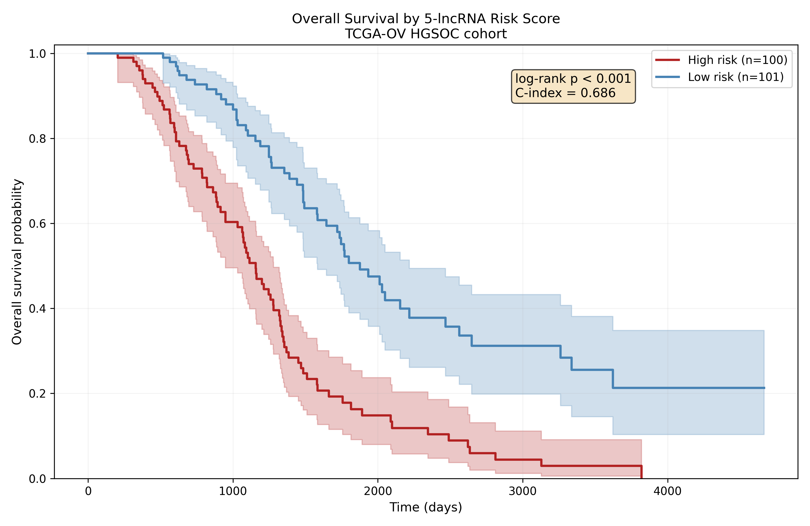

# Kaplan-Meier Survival Analysis with a 5-lncRNA Risk Score

## Question
[Project 01](../01-differential-expression) found that no single lncRNA
survives multiple-testing correction. Does a composite score built from several
of them stratify HGSOC patients by overall survival?

## Background
Individually weak markers can combine into a strong one when their errors are
partly independent, which is why clinical gene signatures are nearly always
multi-gene panels rather than single genes. The question now is to determine the
biological relevance of the distributed signal from project 01.

## The signature
Five lncRNAs: hardcoded in the script as `SIGNATURE_LNCRNAS`:

| Ensembl ID | Symbol | Hazard ratio | 95% CI | p-value |
|---|---|---|---|---|
| ENSG00000251665 | none | 0.757 | 0.602–0.953 | 0.018 |
| ENSG00000258572 | SYNE3-AS1 | 0.663 | 0.529–0.832 | < 0.001 |
| ENSG00000241912 | none | 0.867 | 0.706–1.064 | 0.172 |
| ENSG00000260505 | none | 0.756 | 0.626–0.911 | 0.003 |
| ENSG00000287733 | none | 0.742 | 0.612–0.900 | 0.003 |

Provenance: these were picked in the parent study by LASSO-Cox regression over
the lncRNAs that were both differentially expressed (project 01) and associated
with survival in univariate Cox models, then ranked by how often they were
selected across 1000 bootstrap resamples.

All five hazard ratios sit below 1, so higher expression is protective in every
case. Four of the five are unnamed Ensembl loci with no assigned gene symbol,
which is typical for lncRNAs as these are largely
uncharacterised transcripts.

## Method
1. Standardize the five lncRNAs (z-score) so the coefficients are comparable
2. Multivariate Cox proportional hazards model, adjusted for age at diagnosis
3. Risk score = the partial hazard predicted by the model
4. Split the cohort at the median risk score
5. Log-rank test between the high- and low-risk groups

Cohort: 201 of the 216 patients, with 134 deaths. Fifteen patients drop out
because age at diagnosis is missing and Cox needs complete cases.

## Results



The two groups separate cleanly and stay separated for the full follow-up
period.

| Metric | Value |
|---|---|
| Log-rank p-value | 1.2 × 10⁻⁹ |
| Harrell C-index | 0.686 |
| Median OS, high risk | 1157 days (~3.2 years) |
| Median OS, low risk | 1877 days (~5.1 years) |

Median survival differs by roughly 720 days, about two years, which is a large
effect for a transcriptomic signature in ovarian cancer.

Age went into the model as a covariate and was not significant (HR 1.011 per
year, p = 0.197), so the separation is not an age artifact.

### Why this matters given the null result in project 01
Taken one at a
time these lncRNAs are unremarkable and one of the five (ENSG00000241912) is
not even significant on its own at p = 0.172. Put together, they reach
p = 1.2 × 10⁻⁹. 

### Limitations
- This is not out-of-sample performance. The signature was selected on this
  cohort, so the C-index of 0.686 is optimistic. A held-out or external cohort
  would give the real number.
- A median split is convenient but arbitrary and it throws away the ordering
  within each group.
- C-index 0.686 is clearly better than chance but it falls below the ~0.7
  usually cited as the bar for standalone clinical utility.

[Project 03](../03-time-dependent-roc) tests the score against the clinical
variables an oncologist already has.

## Output
- `figures/kaplan_meier.png`, the figure above

## Usage
```bash
# from the repository root, once
python prepare_data.py

# then
cd 02-survival-risk-score
python survival_analysis.py
```

## Dependencies
```bash
pip install pandas numpy matplotlib lifelines
```
