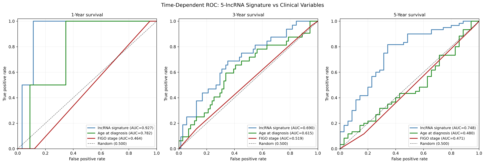

# Time-Dependent ROC: lncRNA Signature vs Clinical Variables

## Question
[Project 02](../02-survival-risk-score) showed that the 5-lncRNA risk score
separates survival curves. Does the signature add anything biologically relevant that is not provided by FIGO score and age?

## Background
A biomarker that only recapitulates known clinical variables is not clinically
useful, however small its p-value. The honest test is a head-to-head comparison
against the existing standard of care, run on the same patients.

Survival prediction is also time-dependent. The
comparison is made separately at 1, 3 and 5 years to determine the relevance of the biomarker at different time-intervals.

## Method
1. Refit the project 02 Cox model to get risk scores, so this project stands
   alone
2. Encode FIGO stage on an ordinal scale, collapsing substages (IIIA/IIIB/IIIC
   all map to 3)
3. At each horizon, label patients dead or alive
4. Compute ROC and AUC for each of the three predictors

Patients censored before a horizon are excluded at that horizon. Their status
there is genuinely unknown, and assuming either outcome would bias the result.

All three predictors are evaluated on the same complete-case cohort of 128
patients with 79 deaths, since comparing AUCs computed on different subsets
would not mean much. FIGO stage is the limiting variable (missing for 88 of the
216 patients).

## Results



| Predictor | 1-year | 3-year | 5-year |
|---|---|---|---|
| lncRNA signature | 0.927 | 0.690 | 0.748 |
| Age at diagnosis | 0.782 | 0.615 | 0.480 |
| FIGO stage | 0.464 | 0.519 | 0.471 |

The signature comes out ahead of both clinical variables at every horizon.

The 5-year column is the most informative one: 0.748 for the signature against
0.480 for age and 0.471 for FIGO stage, both of which are indistinguishable
from random guessing at that horizon. In this cohort the signature is the only
one of the three carrying real long-term prognostic information.

### The 1-year panel should not be trusted
An AUC of 0.927 is an extremely promising result. However, it means very little here, because only 2
patients died within the first year among the 126 evaluable. 

The 3-year and 5-year panels, with 32 and 60 deaths, are substantive
results.

### Why FIGO stage does so badly
This is a cohort artifact rather than a claim that stage is uninformative in
ovarian cancer. Of the 128 patients with staging data, 107 are stage III and 15
are stage IV, so the cohort is almost entirely advanced-stage by construction.
HGSOC is usually diagnosed late. With essentially no variation left in the
variable it cannot discriminate. Stage separates early disease from late
disease, and there is virtually no early disease here.

### Limitations
- The signature was selected on this cohort, so the comparison
  favours the signature by construction and should be repeated out-of-sample.
- Restricting to complete FIGO data cuts the cohort from 216 to 128.

## Output
- `figures/time_dependent_roc.png`, the figure above

## Usage
```bash
# from the repository root, once
python prepare_data.py

# then
cd 03-time-dependent-roc
python time_dependent_roc.py
```

## Dependencies
```bash
pip install pandas numpy matplotlib scikit-learn lifelines
```
