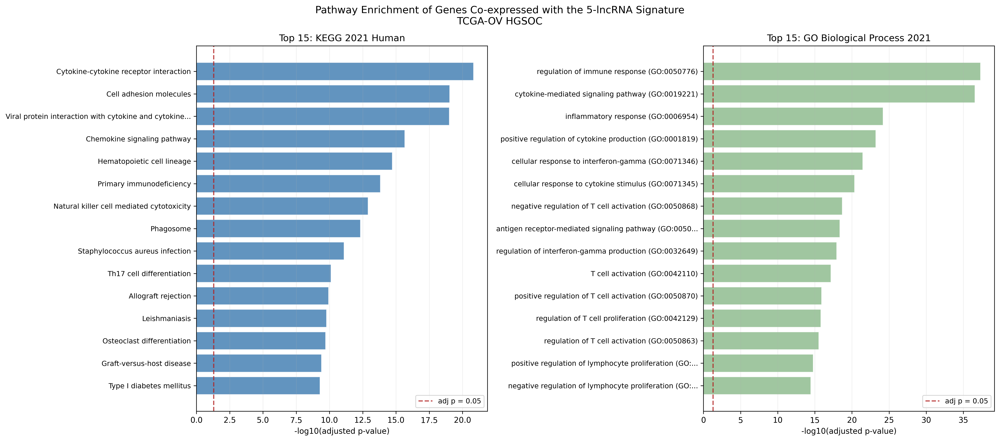

# Pathway Enrichment of Genes Co-expressed with the lncRNA Signature

## Question
The earlier projects establish that the 5-lncRNA signature predicts survival.
What biology does it sit in?

## Background
lncRNAs are hard to interpret directly. They have no reading frame, and four of
the five signature lncRNAs have no assigned gene symbol at all. The usual
workaround is guilt by association: find the protein-coding genes whose
expression tracks the lncRNA across patients, then ask what those genes do.
This does not establish causation, since co-expression can reflect shared
regulation, shared cell-type composition, or a genuine regulatory relationship.
It does say which biological programme the lncRNA is embedded in.

## Method
1. Spearman correlation between each signature lncRNA and all 18,519
   protein-coding genes in the matrix
2. Keep pairs with |rho| ≥ 0.3 and p < 0.05
3. Take the union of correlated genes across the five lncRNAs
4. Map Ensembl IDs to symbols using GENCODE v44
5. Over-representation analysis against KEGG 2021 and GO Biological Process
   2021 via Enrichr

Spearman is computed as Pearson correlation on ranks through a single matrix
product, which is equivalent to looping over ~18.5k genes five times and much
faster. Protein-coding status comes from GENCODE rather than being inferred as
"not a lncRNA", so pseudogenes and other biotypes are properly excluded.

At n = 216, |rho| ≥ 0.3 already corresponds to p ≈ 7 × 10⁻⁶, so the correlation
threshold rather than the p-value threshold is doing the filtering.

## Results



513 protein-coding genes are co-expressed with at least one signature lncRNA.
The enrichment is strong and consistent:

- 63 significant KEGG pathways (adj p < 0.05)
- 543 significant GO Biological Process terms (adj p < 0.05)

| Top KEGG pathway | Adjusted p |
|---|---|
| Cytokine-cytokine receptor interaction | 1.45 × 10⁻²¹ |
| Cell adhesion molecules | 8.83 × 10⁻²⁰ |
| Viral protein interaction with cytokine receptors | 9.70 × 10⁻²⁰ |
| Chemokine signaling pathway | 2.15 × 10⁻¹⁶ |
| Hematopoietic cell lineage | 1.85 × 10⁻¹⁵ |

| Top GO Biological Process | Adjusted p |
|---|---|
| Regulation of immune response | 4.69 × 10⁻³⁸ |
| Cytokine-mediated signaling pathway | 2.71 × 10⁻³⁷ |
| Inflammatory response | 6.12 × 10⁻²⁵ |
| Positive regulation of cytokine production | 5.93 × 10⁻²⁴ |
| Cellular response to interferon-gamma | 3.44 × 10⁻²² |

Every top term is immune: cytokine signaling, chemokine signaling, T-cell
activation and proliferation, interferon-gamma response, natural killer cell
cytotoxicity, antigen receptor signaling. Not DNA repair, not drug efflux, not
apoptosis, which are the three mechanisms most often proposed for platinum
resistance.

### Interpretation
This points at the tumour immune microenvironment rather than a cell-intrinsic
resistance mechanism. That is biologically coherent, since immune infiltration
is an established prognostic factor in HGSOC. It also offers a plausible
account of why the signature predicts survival strongly (projects 02 and 03)
while the underlying lncRNAs are only weakly associated with platinum response
itself (project 01). The signature may be reading out immune context more than
chemoresistance biology.

One caveat follows directly from that. Bulk RNA-seq cannot separate expression
in tumour cells from expression in infiltrating immune cells, so an immune
signature recovered from bulk tissue may partly reflect how much immune tissue
is in the sample rather than a regulatory programme inside the tumour cells.
Deconvolution or single-cell data would be needed to tell these apart.

### Two lncRNAs contributed nothing
The co-expressed genes are not evenly sourced:

| lncRNA | Co-expressed genes |
|---|---|
| ENSG00000258572 (SYNE3-AS1) | 463 |
| ENSG00000241912 | 46 |
| ENSG00000287733 | 29 |
| ENSG00000251665 | 0 |
| ENSG00000260505 | 0 |

SYNE3-AS1 alone accounts for about 90% of the gene set, so the enrichment
result is substantially a statement about that one lncRNA rather than about the
signature as a whole. Two of the five have no protein-coding partner above the
threshold at all, despite both being significant predictors in the Cox model
(HR 0.757 and 0.756). Their prognostic contribution is not explained by this
analysis. They may act through mechanisms co-expression cannot see, or at
correlation strengths below the |rho| ≥ 0.3 cut.

## Output
- `figures/pathway_enrichment.png`, the figure above
- `results/kegg_enrichment.csv` and `results/go_enrichment.csv`, the full
  enrichment tables. Regenerated on each run, not tracked in git.

## Usage
```bash
# from the repository root, once
python prepare_data.py

# then
cd 04-pathway-enrichment
python pathway_enrichment.py
```

Needs network access for the Enrichr API.

## Dependencies
```bash
pip install pandas numpy scipy matplotlib gseapy
```
