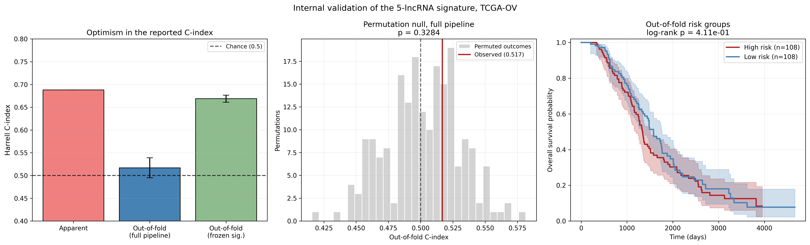

# Honest Validation: How Much of the Signature Is Real?

## Question
Projects [02](../02-survival-risk-score) and [03](../03-time-dependent-roc)
report a C-index of 0.686, a log-rank p of 1.2 × 10⁻⁹ and a 5-year AUC of
0.748. All three numbers share a flaw their READMEs acknowledge: the five
lncRNAs were selected using all 216 patients and then scored on those same
216 patients. How much performance survives when no patient is ever scored
by a model that has seen their outcome?

## Background
This is the question that decides whether the first four projects found
biology or built a mirror. Resubstitution estimates are optimistic whenever
feature selection touches the evaluation data, and the effect is severe when
12,290 features are screened on 216 patients. The literature is full of
prognostic signatures published on exactly this kind of estimate, which is a
large part of why so few of them replicate.

External validation would be the ideal fix, but no suitable cohort exists:
GSE268514 has expression without outcomes, and GSE9891 is on a microarray
platform (GPL570) that carries essentially no lncRNA probes. What remains is
internal validation done correctly, which is enough to answer whether an
external cohort is worth chasing.

## Method
Three estimates of the same quantity, from least to most honest:

1. **Apparent (resubstitution)** — the project 02 model, fit and evaluated
   on all 216 patients. This is the optimistic baseline being audited.
2. **Nested cross-validation, frozen signature** — the five published
   lncRNAs are held fixed, but Cox coefficients are refit inside each
   training fold and patients are scored only out-of-fold. Still
   contaminated, because the five were chosen using everyone's outcomes;
   included to show how much apparent signal survives refitting alone.
3. **Nested cross-validation, full pipeline** — the entire selection
   procedure (DE screen → univariate Cox → LASSO-Cox → bootstrap ranking →
   top 5) is re-run from scratch inside every training fold, 10 repeats of
   5 folds. No patient's outcome ever influences the signature used to
   score them. This is the honest number.

On top of that, a **permutation test**: shuffle the survival outcomes and
re-run the whole nested procedure 200 times. With 12k features screened,
an out-of-fold C-index slightly above 0.5 can still be chance; the
permutation null is what says whether it is.

Finally, a **selection-stability audit**: if the pipeline were recovering
real biology, re-running it on 80% of the cohort should keep returning the
same lncRNAs.

## Results



| Estimate | C-index | Permutation p |
|---|---|---|
| Apparent (resubstitution) | 0.688 | — |
| Out-of-fold, frozen signature (still selection-biased) | 0.669 ± 0.008 | 0.005 |
| Out-of-fold, full pipeline | **0.517 ± 0.022** | **0.33** |

The honest estimate is indistinguishable from chance. Splitting patients
into high- and low-risk groups by their out-of-fold scores gives a log-rank
p of 0.41, against the apparent 1.2 × 10⁻⁹. Essentially all of the
signature's reported performance is selection optimism.

The gap between rows 2 and 3 is the informative part. Refitting
coefficients barely dents the C-index (0.688 → 0.669), which is why frozen
"validation" of this kind, common in the literature, proves nothing: the
bias lives in the *choice* of the five genes, not in their coefficients.
Only re-running the choice itself inside each fold exposes it.

The stability audit says the same thing from a different angle. Across 50
training folds the pipeline selected 76 distinct lncRNAs. The most stable
single gene (ENSG00000241912) appeared in 33 of 50 folds; the other four
published lncRNAs came back in 42%, 34%, 30% and 10% of folds. A procedure
recovering real biology would keep choosing the same genes. This one
mostly does not.

### What this means for projects 01–04
- **01** is unaffected: it already reported that nothing survives FDR
  correction, and this result is consistent with that null.
- **02 and 03** describe the *apparent* performance of a signature selected
  and evaluated on the same cohort. Their figures are real and their code
  is correct; their headline numbers are estimates of the wrong quantity.
  Both READMEs now state the honest numbers alongside the apparent ones.
- **04** characterized the co-expression neighbourhood of five specific
  lncRNAs. That analysis is descriptive and stands, but the premise that
  these five carry prognostic signal does not.

### Why this is the most useful result in the repository
Dozens of published ovarian cancer lncRNA signatures were built with
exactly this pipeline — DE screen, univariate Cox, LASSO, evaluate on the
training cohort — and report exactly this kind of number. This repository
built one, got the spectacular apparent statistics, and then measured how
much was real: almost none. That is a reproducible, quantified
demonstration of why such signatures fail to replicate, and it is worth
more than another unvalidated signature would have been.

### Limitations
- Internal validation cannot rule out cohort-specific artifacts that an
  external cohort would catch; it can only remove selection optimism.
- The permutation test uses 200 permutations, so the smallest resolvable
  p is ~0.005.
- The bootstrap inside each fold uses 40 resamples against the parent
  study's 1000, a concession to the 200-fold permutation loop. This makes
  per-fold selection slightly noisier but does not bias the C-index.

## Output
- `figures/validation_optimism.png`, the figure above
- `results/validation_summary.csv`, the three C-index estimates.
  Regenerated on each run, not tracked in git.
- `results/validation_selection_stability.csv`, per-gene selection
  frequencies across folds. Regenerated on each run, not tracked in git.

## Usage
```bash
# from the repository root, once
python prepare_data.py

# then
cd 05-honest-validation
python validation.py
```
The permutation test re-runs the full selection pipeline 200 times, so
expect a runtime of a few hours. Progress is printed every 25 permutations.

## Dependencies
```bash
pip install pandas numpy scipy matplotlib scikit-learn scikit-survival lifelines
```
